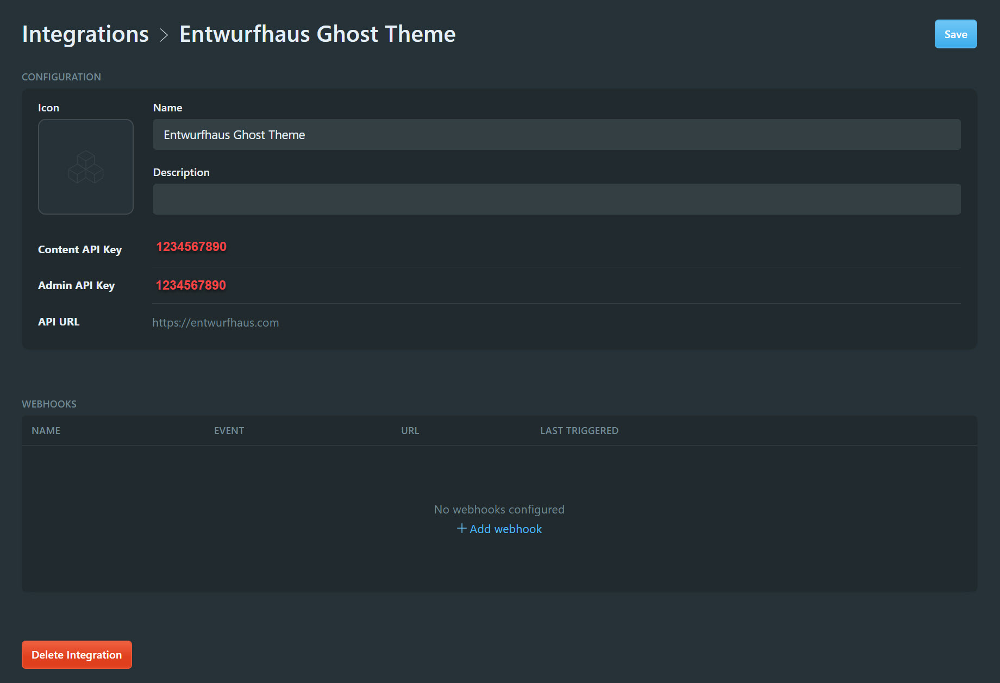

# Entwurfhaus Ghost Theme 👻

   

A Ghost theme, built for the [Entwurfhaus](https://entwurfhaus.com) website. It is using the TailwindCSS, a highly customizable, low-level CSS framework.

# Summary

This template was forked from the [TryGhost/Starter](https://github.com/TryGhost/Starter) ✌️ resource. The goal is to utilize TailwindCSS, for building a custom Ghost theme.

# Development

## Overview

Styles are compiled using Gulp/PostCSS to polyfill future CSS spec. This project requires:

1. [Node](https://nodejs.org/)
1. [Yarn](https://yarnpkg.com/) 
1. [Gulp](https://gulpjs.com)
1. [TailwindCSS](https://tailwindcss.com)

After that, from the theme's root directory:

```bash
# Install
yarn

# Run build & watch for changes
$ yarn dev
```

Next, edit `/assets/css/` files, which will be compiled to `/assets/built/` automatically.

The `zip` Gulp task packages the theme files into `dist/<theme-name>.zip`, which you can then upload to your site.

```bash
# Run to create a Ghost theme deployment package
yarn zip
```

## Process

1. Using yarn, install the ``ghost-cli`` as below:
    ```bash
    yarn global add ghost-cli@latest
    ```
1. Create a new local Ghost project. For example:
    ```bash
    # Tip: Do not name your project 'ghost'
    mkdir awesome-ghost
    cd awesome-ghost

    # Run the install command, it will automatically start
    ghost install local
    ```
1. If you need to further manage your local ``ghost``, there are some useful commands below:

    ```bash
    # Stop ghost
    ghost stop

    # Start ghost
    ghost start

    # View logs
    ghost log

    # List all running Ghost blogs
    ghost ls
    ```
1. Finally, a simple local development process can be achieved by placing your Ghost theme into the ``themes`` folder, such as ``content\themes\awesome-ghost-theme``. It is from there, using ``yarn dev`` while you're previewing your theme changes on the locally hosted ``awesome-ghost``.    

## Github Workflows

There are two pre-defined GitHub workflows, **Deploy Theme** and **Test**. 

1. **Deploy Theme** allows automatic deployment of your custom Ghost theme, to your designated Ghost website.
1. **Test** just utilizes ``gscan`` and nothing fancy there.

> 🔨 Please feel free to customize these GitHub workflow yaml configurations to your desired needs.

## Deploy Theme

To configure **Deploy Theme** workflow, you will first need to create a new **Integration** in your Ghost.

Below are the steps on how to configure **Deploy Theme**:
1. Log in to your Ghost Admin.
1. Proceed to Settings > Integration. Then, add a new Integration.
1. Click the newly created Integration, and copy/paste both **Content API Key** (it is a randomly generated string of text) and **API URL**.

    
1. Once you have both, proceed to log into your GitHub account and navigate to your Ghost custom theme repository.

    > 🤔 Please note that GitHub settings UI/UX layout gets updated throughout the years and the following steps may become unreliable.

1. When you're at your project repository, proceed to Settings > Secrets. 
1. Once there, you will need to create two Secrets, enter the value for each Secret and click Save. 
   
   Below shows the matching information you've obtained from Ghost Admin:
    1. GHOST_ADMIN_API_URL = API URL
    1. GHOST_ADMIN_API_KEY = Content API Key
1. Now, you are ready to give it a try. To test, you would have to review on how you've set when your actions are triggered (such as on:push in the ``master`` branch), or you could trigger it manually via GitHub. As of this point, you're the boss! 👍

    ```yaml
    name: Deploy Theme
    on:
    push:
        branches:
        - master
    jobs:
    deploy:
        runs-on: ubuntu-18.04
        steps:
        - uses: actions/checkout@master
        - name: Deploy Ghost Theme
            uses: TryGhost/action-deploy-theme@v1.2.0
            with:
            api-url: ${{ secrets.GHOST_ADMIN_API_URL }}
            api-key: ${{ secrets.GHOST_ADMIN_API_KEY }}
    ```

# Testing

Validating your Ghost theme is handled efficiently with the [GScan tool](https://gscan.ghost.org/). GScan will check your theme for errors, deprecations and compatibility issues. GScan is used in several ways:

1. The [GScan site](https://gscan.ghost.org/) is your first port of call to test any themes that you're building to get a full validation report

1. When a theme is uploaded in Ghost admin, it will automatically be checked with gscan and any fatal errors will prevent the theme from being used

1. gscan is also used as a command line tool

## Command line

To use GScan as a command line tool, globally install the ``gscan`` npm package:

```bash
# Install the npm package
npm install -g gscan

# Use gscan <file path> anywhere to run gscan against a folder
gscan /path/to/ghost/content/themes/casper

# Run gscan on a zip file
gscan -z /path/to/download/theme.zip
```